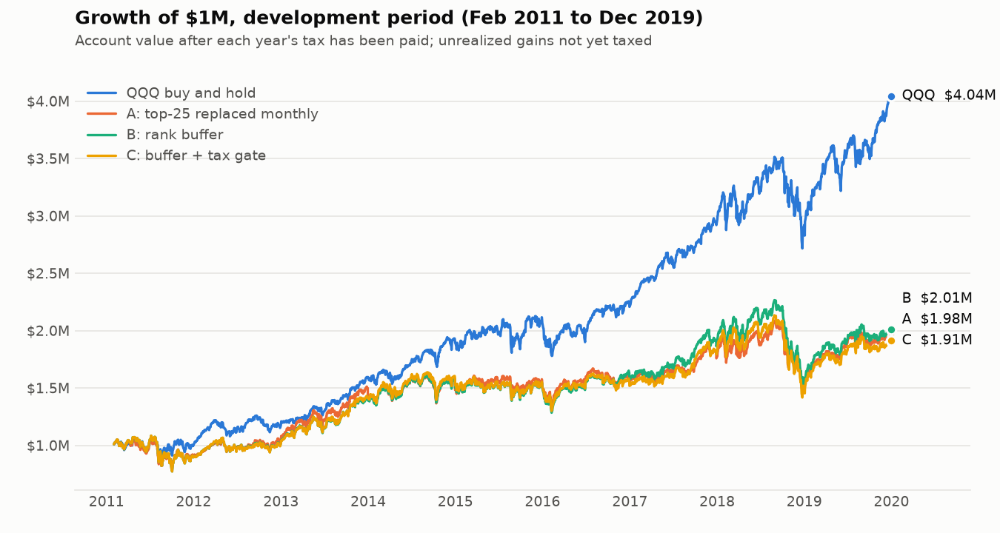
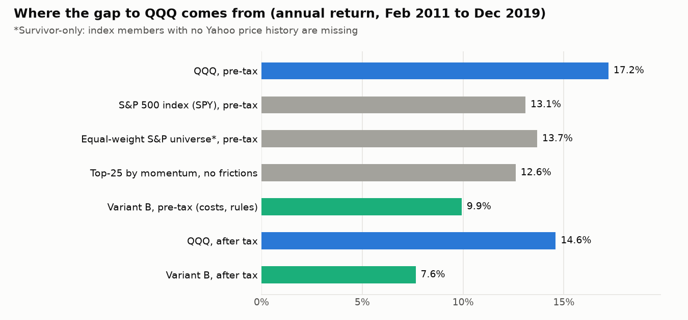
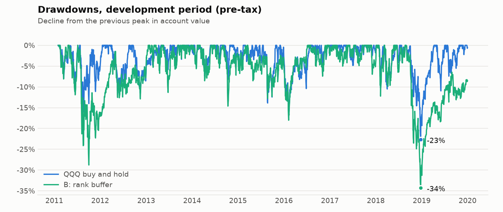

# Backtest report: version 1 (momentum on the S&P 500, after tax, vs QQQ)

*Part of [version_1_rules](README.md). Project overview: [../README.md](../README.md).*

Written 2026-09-24. Covers the **development period only** (Feb 2011 to Dec 2019). The 2020-onward
holdout has deliberately **not** been run (see [Holdout](#holdout-not-run-on-purpose)).

## Bottom line

**Version 1 does not beat QQQ, and by a wide margin.** By the success criteria we agreed before seeing
any results ([`docs/strategy_rules.md`](../docs/strategy_rules.md), section 3), the reading is
*"fails 1 and 2: buy QQQ."*

| Development period, $1M start | QQQ buy and hold | Best variant (B) |
|---|---|---|
| Annual return after tax | **14.6%** | 7.6% |
| $1M becomes (after tax, if sold at the end) | **$3.37M** | $1.93M |
| Worst drawdown (pre-tax) | **-22.7%** | -34.3% |

Three findings matter more than the headline:

1. **Momentum did nothing in this sample.** Its rank correlation with next month's return was 0.001
   (t-stat 0.07), which is statistically zero. A momentum portfolio was indistinguishable from randomly
   chosen stocks: 5 random-score portfolios, run with the same rules as variant C, lost 5.6 to 8.4 points
   a year to QQQ after tax, against 7.6 for C driven by momentum.
2. **Most of the gap is the universe, not the rules.** From 2011 to 2019 the S&P 500 itself returned
   about 13.1% a year and QQQ about 17.2%. Any strategy picking S&P 500 stocks starts about 4 points a
   year behind QQQ before it does anything wrong. To *beat* QQQ it would need roughly 4+ points of
   genuine pre-tax alpha, which is a very high bar.
3. **Taxes are not the problem, pre-tax return is.** Variant B lost 2.3 points a year to tax, less than
   QQQ's 2.6, because it sells losers early (short-term losses offset gains) and holds winners past a
   year. The tax-aware rule we designed (variant C) did not help.

This is a negative result from a working pipeline, and that is a useful thing to know before putting
real money behind it. Cross-checks that the pipeline itself is sound are in
[Robustness and sanity checks](#robustness-and-sanity-checks).

## What was tested

| Piece | What v1 does |
|---|---|
| Universe | S&P 500 **as it was on each date**, rebuilt from Wikipedia's change history (500-506 members throughout). 6 renamed tickers mapped by hand |
| Prices | Yahoo Finance daily, 2010 to 2026-09-23, split-adjusted, dividends as separate cash events |
| Signal | 12-1 momentum: return from 12 months ago to 1 month ago, ranked among index members, computed at each month-end close |
| Trading | Orders fill at the **next trading day's open**, never at the close the signal used. 10 bps cost each side |
| Portfolio | 25 stocks, roughly equal weight. 10% position cap, 30% sector cap |
| Taxes | Lot by lot: 38% short-term, 23% long-term and dividends (35%/20% federal + 3% MA; NIIT off). Year's tax paid from the portfolio each December. Wash sales modeled. Sells choose the cheapest-to-tax lots first |
| Benchmark | QQQ bought on the same day, run through the **same** tax accounting, sold at the end so its deferred tax is counted too |

Three variants, exactly as planned in the rules file:

- **A**: keep the top 25, replace anyone who drops out every month, re-equalize weights. Tax-blind.
- **B**: rank buffer. Buy at rank 25 or better, keep an incumbent until it falls below rank 60.
- **C**: B plus a tax gate: don't sell a short-term gain within 60 days of turning long-term (unless the
  rank is below 150), and don't rebuy a stock for 31 days after selling it at a loss.

The finalist rule was fixed in advance: *the variant with the best after-tax return in the development
period*. That is **B**, though the three are within noise of each other (see below).

## Results (development period, Feb 2011 to Dec 2019, 8.9 years)

| | QQQ | A | **B** | C |
|---|---|---|---|---|
| After-tax annual return (sold at end) | 14.60% | 7.47% | **7.65%** | 7.04% |
| $1M becomes (after tax) | $3.37M | $1.90M | **$1.93M** | $1.83M |
| Pre-tax annual return | 17.21% | 10.56% | **9.93%** | 8.99% |
| After-tax return minus QQQ | | -7.13 | **-6.95** | -7.56 |
| Alpha vs QQQ, after tax, per year | | -5.5% | **-6.5%** | -6.6% |
| Alpha 95% range | | -12.2% to +1.5% | **-14.1% to +1.7%** | -14.1% to +1.6% |
| Beta vs QQQ | 1.00 | 0.87 | **0.96** | 0.92 |
| Worst drawdown (pre-tax) | -22.7% | -29.4% | **-34.3%** | -33.5% |
| Turnover (one-way, per year) | | 390% | **160%** | 158% |
| Total tax (paid + due on sale) | $709k | $407k | **$305k** | $268k |
| Average holdings | | 24.6 | **24.3** | 24.1 |



The chart shows account value after each year's tax has been paid, with unrealized gains still
untaxed. QQQ finishes at $4.04M here but $3.37M once its deferred tax is counted, which is why the
table uses the after-sale figure.

**A, B and C cannot be ranked.** They differ by about 0.6 points a year after tax. Random 25-stock
portfolios run through the same engine differ from one another by up to 2.8 points (see the shuffled
runs below), so gaps that small are noise. The only reliable statement in this table is the size of the
gap to QQQ.



### Where the gap to QQQ comes from

Pre-tax annual returns over the same 107 months:

| Step | Return | What it tells us |
|---|---|---|
| QQQ | 17.2% | The benchmark |
| S&P 500 index (SPY) | 13.1% | The universe alone costs about 4 points |
| Equal-weight S&P names we could price | 13.7% | Consistent with the index (this set is survivor-only, see limits) |
| Top 25 by momentum, monthly, no costs or taxes | 12.6% | Momentum picks were slightly *worse* than the average name |
| Variant B, in the engine, with costs | 9.9% | About 2.7 points lost to costs, cash and rules |

Costs are only part of that last step. Measured directly, with taxes off:

| | Idealized top-25 (monthly, no frictions) | Engine, zero costs | Engine, 10 bps costs |
|---|---|---|---|
| A | 12.6% | 11.4% | 10.6% (costs: -0.9) |
| B | 12.6% | 10.3% | 9.9% (costs: -0.3) |
| C | 12.6% | 9.9% | 9.0% (costs: -0.9) |

The engine differs from the idealized reference through idle cash, sector caps, filling at the next
open, and (for B and C) the buffer and position-cap rules, which change which stocks are held. Because
the signal has no edge, those differences add variance instead of a systematic gain or loss; expect
+/-1 to 3 points between any two 25-stock portfolios over nine years. The variation in the cost column
(B -0.3 versus C -0.9 at nearly identical turnover) is the same noise. It is worth tightening in
version 2, but it is not the main story: even with zero friction the idealized strategy sits about 5
points behind QQQ (12.6% vs 17.4%).

### Taxes

| | Realized short-term net | Realized long-term net | Tax as share of total pre-tax gain |
|---|---|---|---|
| QQQ | none | none realized (about $2.9M unrealized, taxed at the end) | ~22.7% |
| A | +$612k | +$423k | ~28% |
| **B** | **-$278k** | **+$1,146k** | **~23.0%** |
| C | -$574k | +$1,315k | ~23.2% |

B's short-term result is a net *loss*: it sells losers quickly and keeps winners past a year, so gains
are mostly taxed at 23%. That already captures most of what the tax rules aimed for. The tax gate (C)
did not lower the effective tax rate further (23.2% vs 23.0%), and its pre-tax return was lower, though
by an amount inside the noise. Under the plan's own rule ("if C does not clearly beat B, simplify"),
**the tax gate goes**: no benefit was shown, and it adds complexity.



## Signal quality

| Measure, 107 months | Value | Meaning |
|---|---|---|
| Average rank IC | 0.001 | Correlation between rank and next-month return. 0 = no predictive power; 0.02-0.05 would be useful |
| t-stat | 0.07 | Far below 2, so indistinguishable from zero |
| Months with positive IC | 50.5% | A coin flip |
| Top fifth minus bottom fifth | 0.00% per month | No spread at all |
| Top 25 minus average stock | -0.04% per month (-0.5% a year) | No edge |

This does not prove momentum never works. Momentum was famously weak in the 2010s, and 107 months is a
small sample, so the estimate is noisy (our alpha ranges above span roughly +/-8 points). It does say
that *on this data, with this universe*, there is no evidence to trade on.

## Robustness and sanity checks

**The pipeline is not broken:**

- **Random scores show no alpha.** 5 runs with shuffled ranks had pre-tax alpha t-stats between -0.05
  and -0.9. Nothing positive, as required.
- **One extra day of delay barely matters** (-7.24 vs -7.56 for C), so there is no hidden look-ahead.
- **Independent cross-check.** The engine's QQQ result (17.2%) is within 0.2 points of a frictionless
  month-end calculation over the same 107 months (17.4%); the remainder is start day and open-versus-close timing. Variant A with zero friction lands
  about 1 point below the frictionless top-25 series, for the reasons above.
- **42 automated tests**, including hand-calculated tax cases (short vs long term, loss carryforward,
  wash sale, delisting, position cap, next-open fills, no future data in signals) and two tests that
  scramble all prices after the development period and require every development-period number to stay identical.

**Parameter sensitivity** (variant C, one change at a time; these are checks, not re-tuning):

| Change | After-tax return minus QQQ | Turnover |
|---|---|---|
| Base (N=25, rank 60, 12-1) | -7.56 | 158% |
| 20 holdings / 30 holdings | -7.22 / -6.53 | 151% / 166% |
| Sell below rank 40 / 50 / 75 | -5.62 / -7.13 / -7.30 | 214% / 183% / 142% |
| Lookback 6 / 9 months | -5.01 / -3.71 | 319% / 210% |
| No skip month | -5.66 | 150% |

Every neighbor is deeply negative. Shorter lookbacks look less bad, but they are still far short of QQQ,
and I am not adopting them, because picking the least-bad of eight variants after the fact is exactly
how false discoveries are made.

**Trials logged so far: 17** (3 variants, 8 sensitivity runs, 5 shuffled, 1 lag test), in
[`run_log.jsonl`](results/run_log.jsonl).

## Success criteria verdict (finalist B)

| # | Criterion (fixed in advance) | Result | Verdict |
|---|---|---|---|
| 1 | At least ~2 points a year better than after-tax QQQ | **-6.95** (A: -7.13, C: -7.56) | Fail |
| 2 | Positive alpha whose confidence range excludes zero | **-6.5%**, range -14.1% to +1.7% | Fail |
| 3 | Max drawdown no worse than QQQ's | **-34.3% vs -22.7%** | Fail |
| 4 | Advantage holds out of sample | Not run; both dev sub-periods negative (2011-13: -5.2, 2014-19: -10.6) | Not tested |

Reading from the rules file: fails 1 and 2 means **buy QQQ**.

## Did any post-2019 data touch the development results?

Short answer: **no test or tuning used it, and the holdout has not been run.** Because it matters this
much, here is the audit in detail.

**Clean:**

- All 17 logged trials and every equity curve end on **2019-12-31**. Fill dates stop there.
- The signal at each date uses only earlier prices (a test checks this), and orders fill at the next open.
- Every choice (S&P 500, momentum, 25 holdings, rank 60, 10 bps, the finalist rule) was written in the
  rules file *before* any backtest ran. Sensitivity runs were not used to re-tune anything.
- Two automated tests scramble every price after the development period and require the diagnostics and
  a full backtest to be identical.

**A leak I found and fixed while checking this:** an earlier draft of this report used one month of 2020
data. The signal dated 2019-12-31 has a "next month" return that is January 2020, and it was included in the
signal-quality statistics and in the reference series (SPY, equal-weight universe, frictionless top-25).
The backtests themselves were never affected. After the fix, the IC dropped from 0.004 to 0.001, and SPY
and the two universe references moved by 0.1 to 0.3 points; no conclusion changed. The tests above were
added so it cannot recur.

**Later information that legitimately, but imperfectly, enters the development period:**

- **Which companies exist to trade.** We can only trade names Yahoo still has prices for, which depends on
  what happened after 2019 (a company that failed in 2022 is missing). This is the survivorship bias in
  the limits below.
- **The index history.** Membership on each historical date is rebuilt from today's list plus the record
  of changes. That is information we would have had by looking back, but it is not what a trader at the time
  could see.
- **Sector labels** are today's, as noted below.
- **Price adjustments** are as of today (dividend and split adjusted). Returns and ratios are unaffected.
- **My own knowledge of market history** shaped what I proposed to test. I have not fitted anything
  to post-2019 results, but I cannot claim to have zero prior knowledge, which is another reason to keep
  a clean holdout.

## Holdout: not run, on purpose

The 2020-onward data is kept unspent. The holdout is a one-shot test for a *finalist*, and B fails the
development bar by about 9 points. Running it would tell us how a strategy we already reject did in
2020-2026, and, more importantly, it would use up the only clean out-of-sample data before a candidate
that deserves it exists. Once we have looked at it, it cannot be used to test any later idea.

If you would still like to see B's numbers for 2020 to today, I can run it. It is an easy request. The
cost is that the holdout will then be spent for anything built on momentum.

## Limits and biases (read these before trusting any number)

1. **Survivorship bias remains.** Yahoo has no price history for delisted, acquired or bankrupt names,
   so many former index members cannot be traded in the test. Coverage of the index at the start was
   only **69% in 2011**, rising to 89% in 2019 and 99.5% today. Average over the dev period: 79%.
   Of the 697 companies that were index members at any point in 2011-2019, 168 (24%) have no prices.
   Checking Wikipedia's recorded reason for each removal: **74% were acquired or merged**, 21% were dropped
   for size, and 5% are unclear. The size group is mixed: some later failed (Chesapeake, Frontier,
   Windstream, RadioShack), and some are still trading under a new ticker that we did not map (for
   example WLTW is now WTW), so part of the gap is recoverable. Acquired companies usually earn a takeover
   premium before they disappear, so the direction of the bias is **not clearly flattering or harsh**. An
   earlier draft said it skewed toward failures; that overstated it. What is certain is that the sample is
   selected by what happened later, and I cannot quantify the effect on returns.

   | Year | Index members | With prices | Coverage |
   |---|---|---|---|
   | 2011 | 500 | 347 | 69% |
   | 2013 | 500 | 370 | 74% |
   | 2015 | 504 | 391 | 78% |
   | 2017 | 506 | 425 | 84% |
   | 2019 | 506 | 448 | 89% |
   | 2021 | 506 | 467 | 92% |
   | 2023 | 504 | 485 | 96% |
   | 2026 | 503 | 501 | 99.5% |
2. **Index history comes from Wikipedia.** It is checked only by member count (500-506 on every date)
   and by hand-fixing six known ticker renames, not audited name by name. A reused ticker could
   in principle pull in the wrong company's prices; the coverage check would usually catch it, but I did not audit it.
3. **Sector caps use today's sector labels.** Names that left the index have no label and are not capped.
4. **Costs are simple**: a flat 10 bps each side and fills exactly at the next open, with no market
   impact. Fractional shares are allowed.
5. **Tax model is simplified**: flat rates, all dividends treated as qualified, NIIT off, MA rate of 3%
   taken from you and not verified, wash sales only checked for repurchases *after* a loss sale, the
   $3,000 loss deduction ignored, tax paid from the portfolio each December.
6. **Small sample.** 107 monthly observations. The alpha confidence ranges are about 16 points wide, so a
   real edge of a couple of points could not be detected, and neither could a small negative one.
7. **Prices are not cross-verified** against a second data vendor. I spot-checked splits (AAPL) and
   investigated one flagged jump (AAL, a real event on 2020-06-04).
8. **Momentum only.** The quality factor needs filing-date-correct fundamentals (SEC EDGAR) and is not
   built. The rules file lists it as phase 2.
9. **The engine differs slightly from the idealized reference** (about 1 point, explained above) and variant A
   carries about 4% idle cash by construction.

## What I would do next

Given this result, in order of how much I would trust each path:

| Option | What it is | Honest odds and cost |
|---|---|---|
| **1. Same rules on the Nasdaq-100** | Rank Nasdaq-100 members (history is also on Wikipedia) and compare against QQQ, so the universe matches the benchmark | Cheap: reuses everything. Removes the "S&P 500 is 4 points behind" handicap, but momentum showed no edge here and the hurdle stays high |
| **2. Add the quality factor** | Profitability and leverage from SEC filings, combined with momentum | Larger effort (correct filing dates). The literature says it pairs well with momentum, but it must still overcome the universe gap |
| **3. Tax alpha instead of stock-picking alpha** | Hold the Nasdaq-100 stocks directly (a QQQ replica) and harvest losses in a taxable account, using the lot-level engine we already built | Different idea: the edge would come from taxes at your 38%/23% rates, not from beating the market. It is commonly said to be worth around 1% a year, front-loaded and dependent on having gains to offset, but I have not verified that here. We would test it with the same engine and the same QQQ comparison |
| 4. Stop here and hold QQQ | | Costs nothing and matches the evidence so far |

My recommendation is **option 1 first** (a day of work on the existing framework, and it answers whether
the universe was the problem), and to seriously consider option 3, because it targets the one thing
in this project that is measurably yours to control: taxes. I would not build option 2 until option 1
tells us whether momentum has anything to work with.

## Decisions for you

1. Which direction next: 1, 2, 3, or stop?
2. OK to leave the holdout unspent?
3. Confirm the tax inputs when you can: does NIIT (3.8%) apply, and is 3% the right MA rate on
   investment gains? Both are single config values (`TAX` in `src/alpha_finder/research.py`).

## Reproduce

```bash
python -m venv venv && source venv/bin/activate
pip install -r requirements.txt && pip install -e .
python -m pytest                          # 42 tests
python scripts/fetch_universe_prices.py   # downloads ~800 tickers into data/prices/ (about 1 minute)
python version_1_rules/run_dev.py         # development-period runs (logged once each in version_1_rules/results/run_log.jsonl)
python version_1_rules/make_dev_assets.py # reference numbers and figures
```

The index snapshot used is in [`data/universe/`](../data/universe/) (pulled 2026-09-24), so the universe does not
change if Wikipedia does. Prices are re-downloaded from Yahoo and may drift slightly over time. Re-running
is safe: a trial that is already in the run log is not logged twice, so the count of 17 stays accurate.

## Terms

- **After-tax annual return (CAGR):** the yearly growth rate of the final value after paying all taxes,
  including tax due if everything were sold at the end.
- **Alpha:** return not explained by moving with QQQ. Positive alpha is what "beating QQQ" should mean.
- **Beta:** how much the strategy moves with QQQ. 1.0 = the same swings.
- **Drawdown:** the drop from a previous peak to the following low.
- **IC (information coefficient):** correlation between a stock's rank and its return the next month.
- **Turnover:** how much of the portfolio is sold each year. 160% means the equivalent of 1.6 full
  portfolios sold per year, an average holding of about 7 months.
