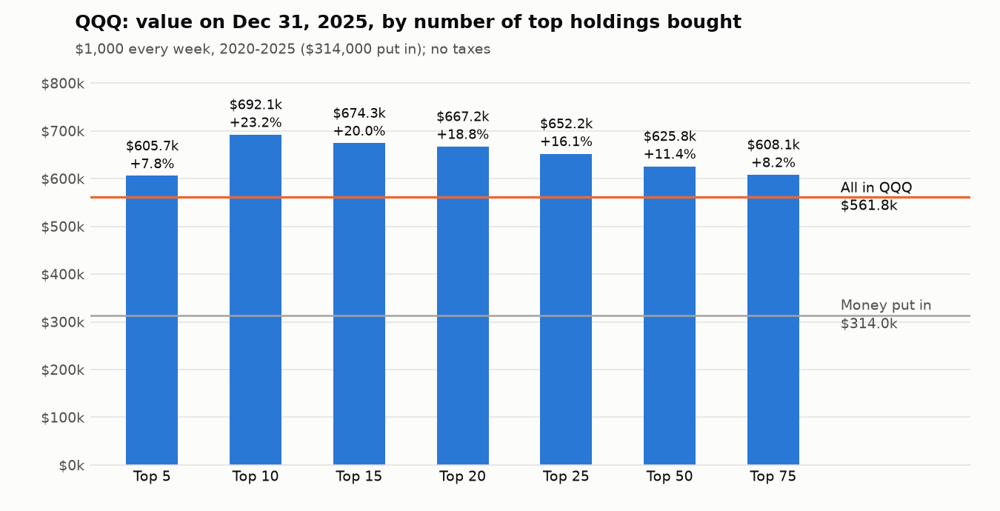
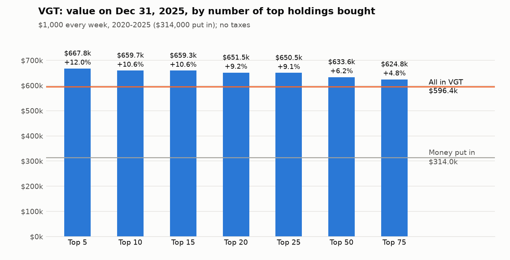
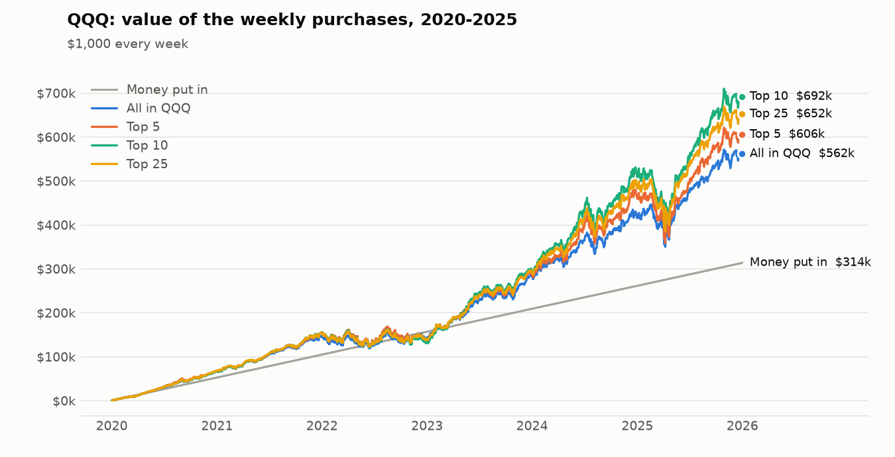
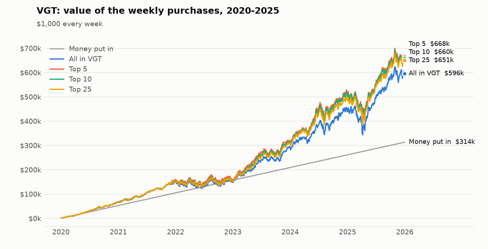

# Version 3: buy the top holdings of QQQ or VGT instead of the ETF itself?

*Part of [version_3_etf_topn](README.md). Project overview: [../README.md](../README.md).*

Written 2026-09-24. A pure calculation: no taxes, no trading costs.

## Bottom line

**Yes, in 2020-2025 buying only the top holdings would have left you with more money than buying the ETF.**
That was true for every size tested (top 5 to top 75), for both QQQ and VGT, and for both contribution plans.

**The best was QQQ's top 10.** With $1,000 every week ($314,000 put in in total), it ended 2025 at **$692,140**.
All in QQQ ended at $561,816 and all in VGT at $596,376. That is **+23.2%** more than QQQ and +16.1% more than
VGT. With the growing plan ($1,000 a week in 2020, 15% more each year), it was $942,828 against $772,542 for
QQQ: +22.0%. Within VGT, its top 5 did best: +12.0% over VGT.



Three things to know before acting on it:

1. **About a quarter of the advantage comes from never selling, not from choosing the top N.** QQQ and VGT
   must follow index rules that cap how much their biggest companies can weigh, so they regularly sell some of
   their biggest winners. Someone who buys the same stocks and never sells keeps all of them. Buying *every*
   stock in QQQ at its weight and never selling beat QQQ by 6.5% (VGT: 2.9%). Concentrating in the top N added
   the rest. In 2023-2025, the biggest companies (Nvidia above all) were the biggest winners, so both effects
   paid off.
2. **It is not a consistent winner year by year.** In 2022, every QQQ top-N from top 5 to top 50 lost more than
   QQQ (top 10: 8.3% worse). The best N changed almost every year: top 25, 10, 75, 10, 10, then 5. Picking "top 10"
   now is choosing with hindsight. The safer summary: in this period, anything from QQQ top 10 to top 25 beat QQQ
   by 16-23%.
3. **It ends up very concentrated.** QQQ top 10 finished with Nvidia at 21% of the portfolio, Apple 18% and
   Microsoft 15%. VGT top 5 finished with Apple 35%, Microsoft 28% and Nvidia 27%: 90% in three stocks. This is a
   bet that the largest companies keep winning. 2020-2025 rewarded that bet. A tech bust like 2000-2002 would punish
   it, and these years contain nothing like that.

## What was calculated

| Item | Rule |
|---|---|
| Purchases | Every Wednesday at the close, from Jan 2, 2020 (Jan 1 was a holiday) to Dec 31, 2025: 314 purchases |
| Flat plan | $1,000 each week: $314,000 in total |
| Growing plan | $1,000 a week in 2020, then 15% more each year ($1,150 in 2021, $1,322.50 in 2022, $1,520.88 in 2023, $1,749.01 in 2024, $2,011.36 in 2025): $458,206 in total |
| Top N | The fund's N largest holdings that week. The week's money is split in proportion to their fund weights (for example, the last QQQ top-10 purchase put $182 into Nvidia, $161 into Apple, $145 into Microsoft...) |
| Selling | Never |
| Dividends | Reinvested in the stock that paid them. The ETF benchmarks reinvest their dividends too |
| Spin-offs | You keep the new company's shares (Exelon's Constellation, IBM's Kyndryl, Honeywell's Solstice, and others) |
| Buyouts | Cash received sits uninvested; acquirer shares received are kept (e.g. Xilinx holders got AMD shares) |
| Value | Everything valued at the close on Dec 31, 2025 |
| Benchmarks | The same money put entirely into QQQ, entirely into VGT, or kept as cash (no interest) |

**Where the holdings come from.** The funds' own quarterly filings with the SEC (26 for QQQ, 25 for VGT, 2019-2025).
Between filings, each stock's weight is moved with its price, which is what the fund's daily holdings page would
show. Two index changes happened between filings and are handled separately: QQQ's special rebalance in July 2023
(which cut its seven largest weights) and VGT's June 2023 removal of payment companies such as Visa and
Mastercard from the tech sector. Alphabet has two share classes (GOOGL and GOOG) that QQQ lists as two holdings,
so "top 10" can mean nine companies.

"Yearly return" below is the money-weighted return: the single yearly rate that turns the weekly contributions
into the final value.

## Results, 2020-2025: $1,000 every week

| Portfolio | Money put in | Value on Dec 31, 2025 | vs all-in QQQ | vs all-in VGT | Yearly return* |
|---|---:|---:|---:|---:|---:|
| All in QQQ | $314,000 | $561,816 | +0.0% | -5.8% | 19.5% |
| All in VGT | $314,000 | $596,376 | +6.2% | +0.0% | 21.5% |
| Cash (kept, no interest) | $314,000 | $314,000 | -44.1% | -47.3% | 0.0% |
| QQQ top 5 | $314,000 | $605,715 | +7.8% | +1.6% | 22.1% |
| QQQ top 10 | $314,000 | $692,140 | +23.2% | +16.1% | 26.6% |
| QQQ top 15 | $314,000 | $674,278 | +20.0% | +13.1% | 25.7% |
| QQQ top 20 | $314,000 | $667,169 | +18.8% | +11.9% | 25.4% |
| QQQ top 25 | $314,000 | $652,214 | +16.1% | +9.4% | 24.6% |
| QQQ top 50 | $314,000 | $625,771 | +11.4% | +4.9% | 23.2% |
| QQQ top 75 | $314,000 | $608,101 | +8.2% | +2.0% | 22.2% |
| QQQ all holdings, never sold | $314,000 | $598,312 | +6.5% | +0.3% | 21.6% |
| VGT top 5 | $314,000 | $667,834 | +18.9% | +12.0% | 25.4% |
| VGT top 10 | $314,000 | $659,670 | +17.4% | +10.6% | 25.0% |
| VGT top 15 | $314,000 | $659,317 | +17.4% | +10.6% | 24.9% |
| VGT top 20 | $314,000 | $651,510 | +16.0% | +9.2% | 24.5% |
| VGT top 25 | $314,000 | $650,508 | +15.8% | +9.1% | 24.5% |
| VGT top 50 | $314,000 | $633,641 | +12.8% | +6.2% | 23.6% |
| VGT top 75 | $314,000 | $624,766 | +11.2% | +4.8% | 23.1% |
| VGT all holdings, never sold | $314,000 | $613,584 | +9.2% | +2.9% | 22.5% |



## Results, 2020-2025: $1,000 a week in 2020, 15% more each year

The ranking is the same as with the flat plan.

| Portfolio | Money put in | Value on Dec 31, 2025 | vs all-in QQQ | vs all-in VGT | Yearly return* |
|---|---:|---:|---:|---:|---:|
| All in QQQ | $458,206 | $772,542 | +0.0% | -5.2% | 20.0% |
| All in VGT | $458,206 | $814,659 | +5.5% | +0.0% | 22.0% |
| Cash (kept, no interest) | $458,206 | $458,206 | -40.7% | -43.8% | 0.0% |
| QQQ top 5 | $458,206 | $834,448 | +8.0% | +2.4% | 22.9% |
| QQQ top 10 | $458,206 | $942,828 | +22.0% | +15.7% | 27.6% |
| QQQ top 15 | $458,206 | $916,301 | +18.6% | +12.5% | 26.5% |
| QQQ top 20 | $458,206 | $903,612 | +17.0% | +10.9% | 26.0% |
| QQQ top 25 | $458,206 | $884,769 | +14.5% | +8.6% | 25.2% |
| QQQ top 50 | $458,206 | $851,711 | +10.2% | +4.5% | 23.7% |
| QQQ top 75 | $458,206 | $828,087 | +7.2% | +1.6% | 22.7% |
| QQQ all holdings, never sold | $458,206 | $815,490 | +5.6% | +0.1% | 22.1% |
| VGT top 5 | $458,206 | $905,514 | +17.2% | +11.2% | 26.1% |
| VGT top 10 | $458,206 | $892,147 | +15.5% | +9.5% | 25.5% |
| VGT top 15 | $458,206 | $888,224 | +15.0% | +9.0% | 25.3% |
| VGT top 20 | $458,206 | $880,350 | +14.0% | +8.1% | 25.0% |
| VGT top 25 | $458,206 | $879,998 | +13.9% | +8.0% | 25.0% |
| VGT top 50 | $458,206 | $859,060 | +11.2% | +5.5% | 24.1% |
| VGT top 75 | $458,206 | $848,547 | +9.8% | +4.2% | 23.6% |
| VGT all holdings, never sold | $458,206 | $835,040 | +8.1% | +2.5% | 23.0% |

## Year by year: does the winner stay the winner?

Each year below is computed on its own: that year's purchases, valued at that year's end. The last two columns
are the multi-year periods.

| Portfolio | 2020 | 2021 | 2022 | 2023 | 2024 | 2025 | 2024-2025 | 2020-2025 |
|---|---:|---:|---:|---:|---:|---:|---:|---:|
| QQQ top 5 | +0.2% | +3.7% | -9.7% | +2.4% | +8.0% | +3.1% | +6.2% | +7.8% |
| QQQ top 10 | -1.8% | +4.4% | -8.3% | +3.7% | +12.3% | +2.7% | +9.6% | +23.2% |
| QQQ top 15 | -0.1% | +3.2% | -6.2% | +2.7% | +8.8% | +2.5% | +7.0% | +20.0% |
| QQQ top 20 | +0.7% | +3.2% | -5.2% | +2.6% | +6.6% | +1.8% | +5.0% | +18.8% |
| QQQ top 25 | +1.1% | +2.8% | -4.0% | +2.5% | +5.3% | +1.8% | +4.1% | +16.1% |
| QQQ top 50 | +0.2% | +1.1% | -1.0% | +1.3% | +2.1% | +1.8% | +2.8% | +11.4% |
| QQQ top 75 | +0.2% | +0.6% | +0.0% | +0.6% | +1.2% | +0.7% | +1.0% | +8.2% |
| QQQ all holdings, never sold | +0.2% | +0.4% | +0.4% | +0.3% | +0.6% | +0.3% | +0.3% | +6.5% |
| QQQ itself, return that period | 28.2% | 13.8% | -13.1% | 20.7% | 11.1% | 13.0% | 23.5% | 78.9% |
| Best N that period | top 25 | top 10 | top 75 | top 10 | top 10 | top 5 | top 10 | top 10 |

| Portfolio | 2020 | 2021 | 2022 | 2023 | 2024 | 2025 | 2024-2025 | 2020-2025 |
|---|---:|---:|---:|---:|---:|---:|---:|---:|
| VGT top 5 | -1.7% | +7.4% | -1.4% | +0.8% | +4.7% | +1.2% | +3.3% | +12.0% |
| VGT top 10 | -2.1% | +3.2% | -0.8% | +1.1% | +2.5% | +0.8% | +1.3% | +10.6% |
| VGT top 15 | -1.8% | +3.5% | -1.1% | +1.4% | +1.4% | +0.2% | +0.2% | +10.6% |
| VGT top 20 | -1.9% | +3.5% | -0.8% | +1.7% | +0.4% | +0.9% | +1.0% | +9.2% |
| VGT top 25 | -1.5% | +2.9% | -0.7% | +1.5% | +0.0% | +2.0% | +1.9% | +9.1% |
| VGT top 50 | -1.0% | +1.7% | -0.4% | +1.2% | -0.1% | +1.0% | +1.0% | +6.2% |
| VGT top 75 | -0.9% | +1.3% | -0.5% | +1.0% | -0.2% | +0.5% | +0.9% | +4.8% |
| VGT all holdings, never sold | -0.0% | +0.6% | -0.2% | +0.7% | -0.2% | +0.3% | +0.3% | +2.9% |
| VGT itself, return that period | 29.1% | 16.5% | -10.6% | 20.3% | 13.2% | 15.4% | 26.5% | 89.9% |
| Best N that period | top 75 | top 5 | top 50 | top 20 | top 5 | top 25 | top 5 | top 5 |

**Why 2020-2025 is much bigger than the single years added up.** In a single year, the difference only comes from
that year's purchases over a few months. Over the whole period, the 2020-2022 purchases are held through 2023-2025.
By then, the never-sell portfolio had drifted far more into the largest stocks than the ETF was allowed to. For
QQQ top 10, the single years add up to about +13%, but the full period comes to +23%.





## The window you first asked about: 2024-2025

| Portfolio | Money put in | Value on Dec 31, 2025 | vs all-in QQQ | vs all-in VGT | Yearly return* |
|---|---:|---:|---:|---:|---:|
| All in QQQ | $105,000 | $129,697 | +0.0% | -2.4% | 22.7% |
| All in VGT | $105,000 | $132,847 | +2.4% | +0.0% | 25.5% |
| Cash (kept, no interest) | $105,000 | $105,000 | -19.0% | -21.0% | 0.0% |
| QQQ top 5 | $105,000 | $137,675 | +6.2% | +3.6% | 29.7% |
| QQQ top 10 | $105,000 | $142,182 | +9.6% | +7.0% | 33.6% |
| QQQ top 15 | $105,000 | $138,742 | +7.0% | +4.4% | 30.7% |
| QQQ top 20 | $105,000 | $136,240 | +5.0% | +2.6% | 28.5% |
| QQQ top 25 | $105,000 | $135,074 | +4.1% | +1.7% | 27.5% |
| QQQ top 50 | $105,000 | $133,354 | +2.8% | +0.4% | 26.0% |
| QQQ top 75 | $105,000 | $130,989 | +1.0% | -1.4% | 23.9% |
| QQQ all holdings, never sold | $105,000 | $130,106 | +0.3% | -2.1% | 23.1% |
| VGT top 5 | $105,000 | $137,196 | +5.8% | +3.3% | 29.3% |
| VGT top 10 | $105,000 | $134,590 | +3.8% | +1.3% | 27.1% |
| VGT top 15 | $105,000 | $133,157 | +2.7% | +0.2% | 25.8% |
| VGT top 20 | $105,000 | $134,239 | +3.5% | +1.0% | 26.7% |
| VGT top 25 | $105,000 | $135,323 | +4.3% | +1.9% | 27.7% |
| VGT top 50 | $105,000 | $134,220 | +3.5% | +1.0% | 26.7% |
| VGT top 75 | $105,000 | $134,008 | +3.3% | +0.9% | 26.5% |
| VGT all holdings, never sold | $105,000 | $133,302 | +2.8% | +0.3% | 25.9% |

For 2024-2025 alone, QQQ top 10 was again the best (+9.6% over QQQ). VGT's top 5 beat VGT by 3.3%.

## Why the top holdings won

- **What the lists looked like.** QQQ's top 10 at the first purchase (Jan 2020) was Apple, Microsoft, Amazon, Meta,
  both Alphabet classes, Intel, Comcast, Cisco and PepsiCo. At the last purchase (Dec 2025) it was Nvidia, Apple,
  Microsoft, Amazon, Tesla, Meta, both Alphabet classes, Broadcom and Palantir. The list updates itself as
  companies grow, so new winners such as Nvidia, Tesla and Broadcom enter once they are big.
- **Never selling.** By the end of 2025, a portfolio that bought all of QQQ's stocks each week and never sold held
  56% in its seven largest stocks. QQQ held 40% in the same stocks, because its index rules had trimmed them.
- **The period.** 2020-2025 was dominated by a few mega-cap tech companies. Both effects are bets on exactly that.

## How much to trust these numbers

| Check | Result |
|---|---|
| Prices vs the funds' own filings | 9,377 comparisons of Yahoo's price with the price in the fund's filing. 11 were off by more than 2%, all one old company (Coherent, ranked #124 or lower) whose ticker now belongs to a different company; those were removed automatically. None was in any top 75 |
| Holdings without a ticker | QQQ: 0.04% of the fund's weight on average. VGT: about 1%. The run refuses to start if any unpriced holding ranks in the top 75 |
| Spin-offs (7) | Each checked by comparing the drop in the parent's price with the value of the new shares handed out: Dell/VMware 49.3% vs 49.3%, IBM/Kyndryl 4.4% vs 4.2%, Exelon/Constellation 28.7% vs 30.6%, Flex/Nextracker 24.6% vs 26.2%, Illumina/GRAIL 2.7% vs 2.6%, Western Digital/Sandisk 24.4% vs 23.6%, Honeywell/Solstice 5.7% vs 5.7% |
| Buyouts (16) | Terms entered for each company that could be bought (Activision, Xilinx, VMware, Ansys, Splunk, Walgreens and others). The run stops if any held stock stops trading without one |
| Delisted stocks with estimated prices | 17 companies Yahoo no longer carries. **Top 5 to top 25 never bought any of them, so those results use only real prices.** Top 50 and top 75 bought $1,300-$2,800 of them; even with a pessimistic error on every estimated price, the final value would move by at most 0.04-0.11% |
| The benchmarks | Recomputed with a separate plain calculation: identical ($561,816 and $596,376) |
| Weights between filings | Apart from the two handled index events, price-moved weights put 24 or 25 of the next filing's top 25 stocks in the top 25, and were typically within 1-4% of the new weights |
| All-holdings replica | In any single year it lands within 0.7% of its ETF. Over the whole period it pulls ahead, which is the never-sell effect described above, confirmed separately: a single purchase in Jan 2020 of all QQQ's holdings, never sold, beat QQQ by 11.8% |
| Automated tests | 87, including hand-calculated purchases, spin-offs, a cash-and-stock buyout, and growing contributions |

## Limits

1. **One period, one market regime.** The years 2020-2025 favoured the largest tech companies. The same rule
   would likely have done badly in 2000-2002. Free data with holdings starts in 2019, so earlier years were not tested.
2. **The best N is chosen after the fact.** See the year-by-year tables.
3. **No taxes or costs.** Buying only means no capital gains are realized until you sell, just like holding the ETF,
   and dividends are taxed about the same. Cash buyouts are taxable sales, but top 5 to top 25 had none. Buying ten
   stocks a week assumes fractional shares, which many brokers offer free.
4. **Weights between filings are estimates**, moved with prices. Index changes inside a quarter are only captured by
   the next filing, except the two handled explicitly.
5. **Two buyout assumptions**, affecting top 50 and top 75 only and by small amounts: VMware holders got cash or
   Broadcom shares with proration, taken here as half each. Walgreens' extra payment right of up to $3 per share is
   counted as zero.
6. **Cash from buyouts is not reinvested.** This slightly understates top 50 and top 75 ($600-$2,300 left in cash).

## What this means for your goal

Your goal is more money than buying QQQ. In 2020-2025, a simple rule would have done that by a wide margin:
**each week, buy QQQ's top 10 to 25 holdings at their weights, and never sell.** It needs no selling, so in a taxable
account it creates no more tax than holding QQQ.

It is not free extra return, though. It is a concentrated bet that the largest companies keep winning. It gained
when they did and lost ground when they didn't (2022). Over time it leaves you with most of your money in three or
four stocks.

Ideas worth testing next, in order:

1. **Top N with a cap on any one stock**, for example no new money into a stock once it is 15% of your portfolio. This
   shows how much of the advantage survives when concentration is limited.
2. **A mix**: part QQQ, part top N, and how the mix changes the outcome and the 2022 loss.
3. **A longer history** that includes a tech bust (2000-2002), which needs paid historical data.

## Reproduce

```bash
export SEC_USER_AGENT="Your Name your.email@example.com"   # the SEC's rule for automated downloads
python version_3_etf_topn/fetch_holdings.py                # holdings from SEC filings (about 10 minutes)
python version_3_etf_topn/run.py                           # audits, then every portfolio (a few minutes)
python version_3_etf_topn/make_report.py                   # charts, tables and this report
```

All numbers come from `results/results.json`. The tables in this report are filled in from it automatically.
